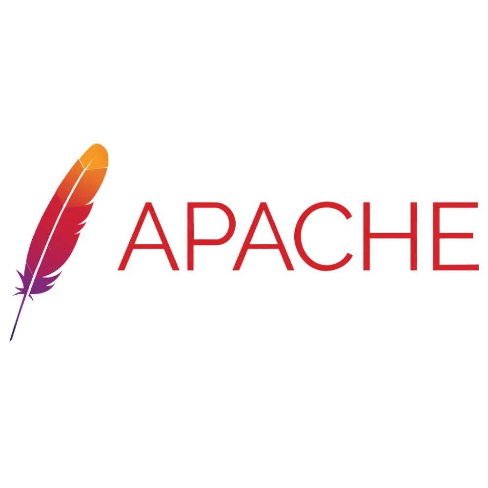
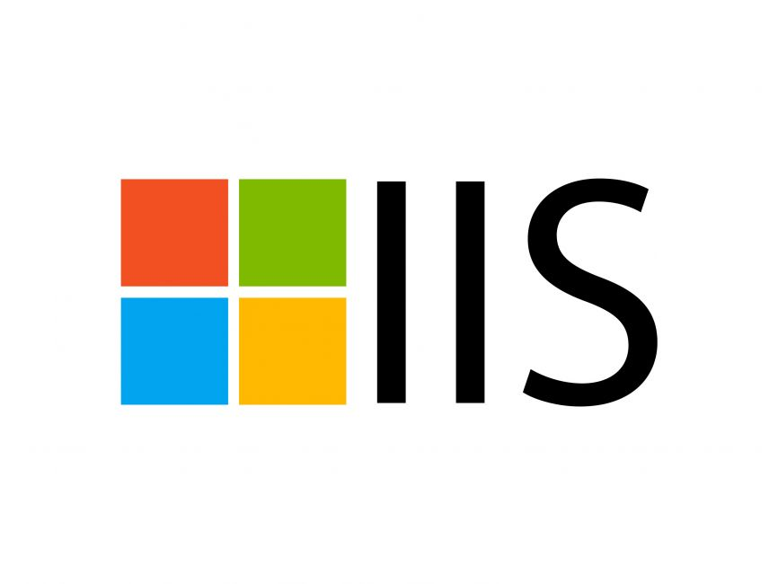

# Deliverable 1

## Questions
### 1. What is a web server?
A system that delivers content all over the internet?

### 2. What are some different web server applications?

#### Application 1

<!-- -->

Apache is an open-source software that  delivers web content over the internet.

* Website: [Apache HTTP Server Project](https://httpd.apache.org/)
* Available for: Linux, Windows, and MacOs.
* Latest Version: 2.4.66

#### Application 2
  
<!-- -->

Nginx is an open-source software used for web infrastructure tasks beyond just web serving.

| Website                           | Availability | Latest version |
| --------------------------------- | ------------ | -------------- |
| [Nginx](https://nginx.org/en/)    |Solaris, BSD Variants, and Linux| NGINX 1.29.5 and NGINX 1.28.2|

  
#### Application 3

<!-- -->

Microsoft IIS A web server hosting anything such as websites, media, and applications.

* Website: [Microsoft](https://www.iis.net/)
* Available for: Windows Server, Windows Client OS, and FTP Sites
* Latest Version: IIS 10.0

### 3. What is virtualization?
Making digital versions of something.

### 4. What is virtualbox?
A powerful virtualization product.

### 5. What is a virtual machine?
a software-based computer that runs an operating system on a host machine.

### 6. In the context of virtualization, what does host machine and guest machine mean?
* **Host Machine:** The system that is running where the hypervisor is installed.

* **Guest Machine** The system that is virtualized in the virtual machine.

### 7. What is Debian?
An organization used to develop free software.

### 8. What is a firewall?
A tool used for enhancing security on your Linux system.

### 9. What is SSH?
A program for logging into a remote machine and executing commands.

### 10. What is an IP Address?
Identifier used for a network interface for devices to communicate.

### 11. What is a network mask?
Used for turning an IP address into network.

### 12. What is a port? (in the context of networking/computers)
A character device file that is an image of the main memory.

### 13. What is port forwarding?
a skill used for directing a request from one port to another.

### 14. What is localhost? (in the context of networking/computers)
The name of the same machine your working on.

### 15. What does this ip address represent 127.0.0.1?
It represents the localhost and loopback address.

### 16. What is Git?
Git is a underlying version control system that runs on local machines and allows you to track changes in coding.

### 17. What is GitHub?
An open source community where people all over the globe can work on different coding projects.

## Concepts I did not understand
* **NAT network**: a skill used to use multiple devices on a local network.
* **SCP**: a command-line utility used to transfer files between local and remote systems.
* **Bridge Network Adapter**:  a software part that connects two or more network interfaces together.