# Deliverable 2

## Questions

### 1. What are the server hardware specifications (virtual machine settings)? 
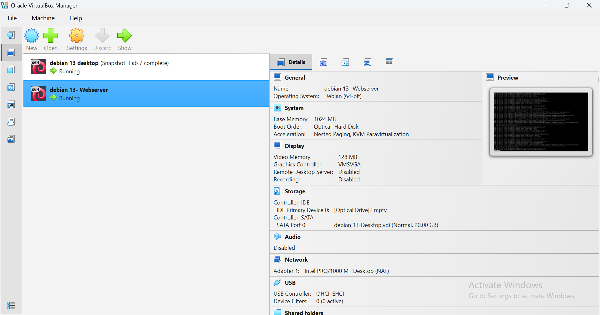

### 2. What is the Debian Login Screen?
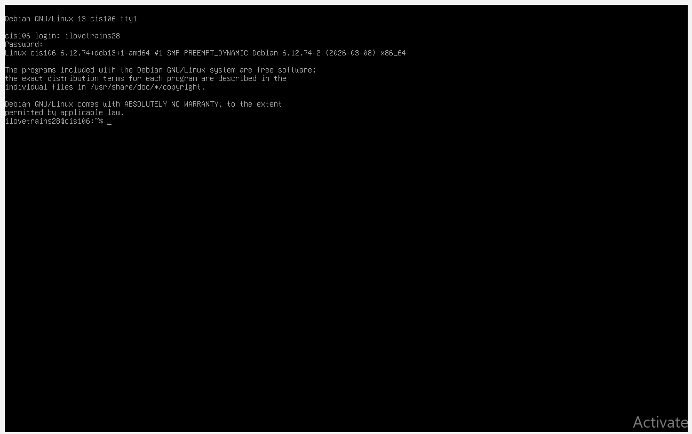

### 3. What is the IP address of your Debian Server Virtual Machine?
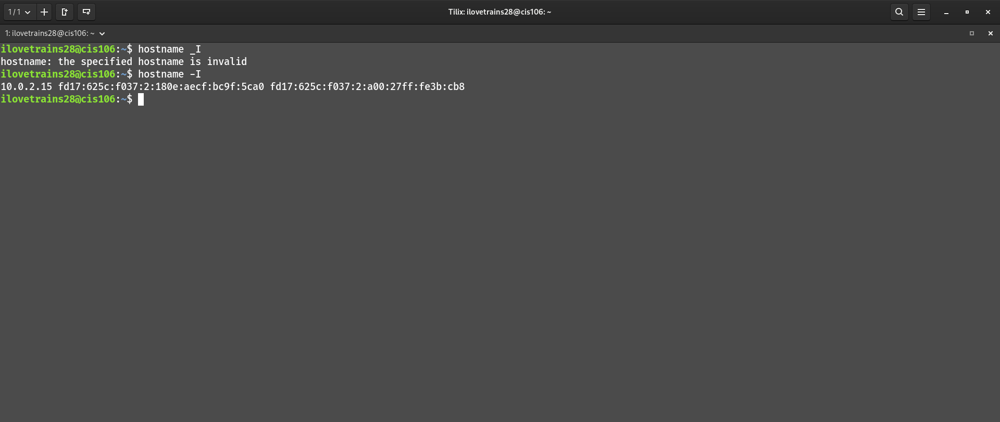
`Hostname -I`

### 4. 

### Command name
* **Description**: Est pariatur sint fugiat mollit ea est veniam proident nulla laboris excepteur.
* **Formula**/**Syntaxt**: `sudo` + `ufw` + `argument` 
* **Examples**:
  * How do you check if the Firewall is running?
    * By using the command `sudo` + `ufw` + `status`
    * Checks to see if ufw is enabled.
  * How do you disable the Firewall?
    * By using the command `sudo` + `ufw` + `disable`
    * Fully disables the firewall service in your system.
  * How do you add Apache to the Firewall?
    * By using the command `sudo` + `ufw` + `allow` + `"Apache Full"`
    * Allows both HTTP and HTTPS traffic on the server.

### 5. What different commands do we use to work with Apache?

**1.  What is the command you use to check if Apache is running?**
* The command is: `systemctl` + `status` + `apache2`
* Checks that Apache is enabled and running.
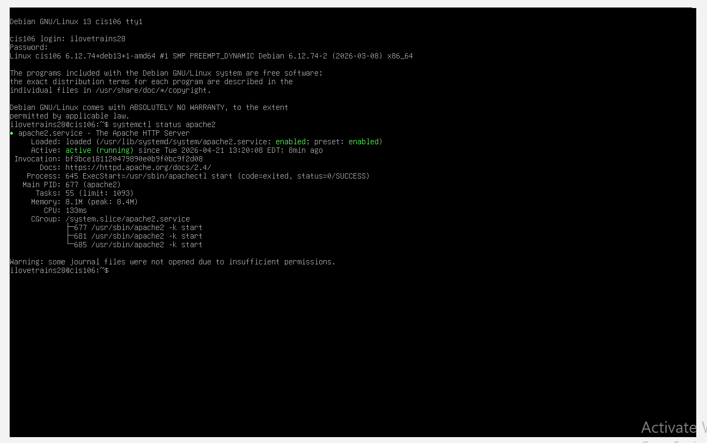

**2.  What is the command you use to stop Apache?**
* The command is: `sudo` + `systemctl` + `stop` + `apache2`
* Stops apache
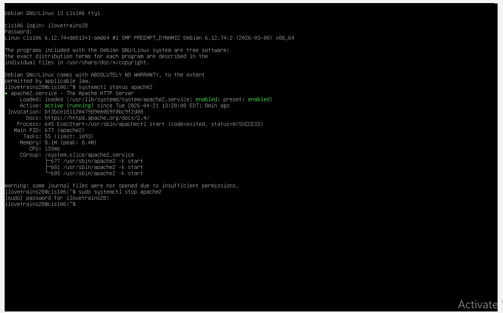

**3.  What is the command you use to restart Apache?**
* The command is: `sudo` + `systemctl` + `restart` + `apache2`
* Reloads Apache
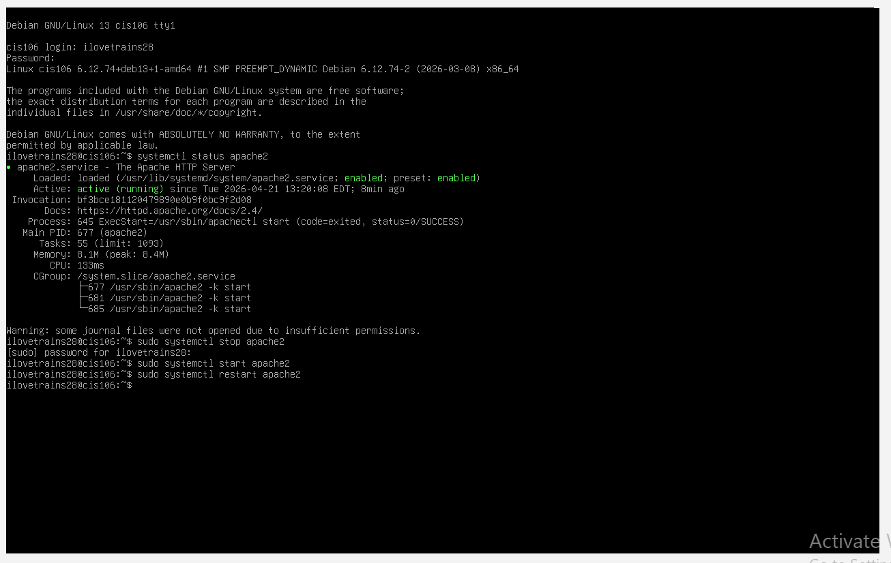

**4.  What is the command used to test Apache configuration?**
* The command is: `sudo` + `apachectl` + `configtest`
* Tests Apache's configuration.
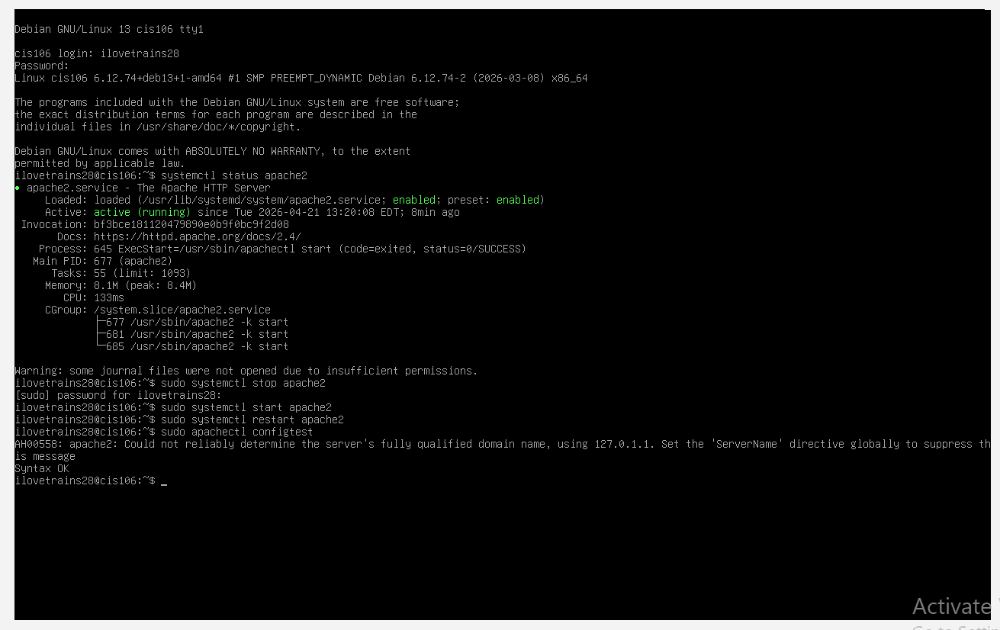

**5.  What is the command used to check the installed version of Apache?**
* The command is: `/usr/sbin/apache2` + `-v`
* Checks current Apache version.

**6.  What are some common configuration files for Apache?**
* The command is: `sudo` + `vim` + `/etc/httpd/conf/httpd.conf`
* Opens the web server’s main configuration file in Vim.

* The command is: `sudo` + `vim` + `/etc/apache2/ports.conf`
* Defines what ports Apache listens on (e.g., 80, 443).
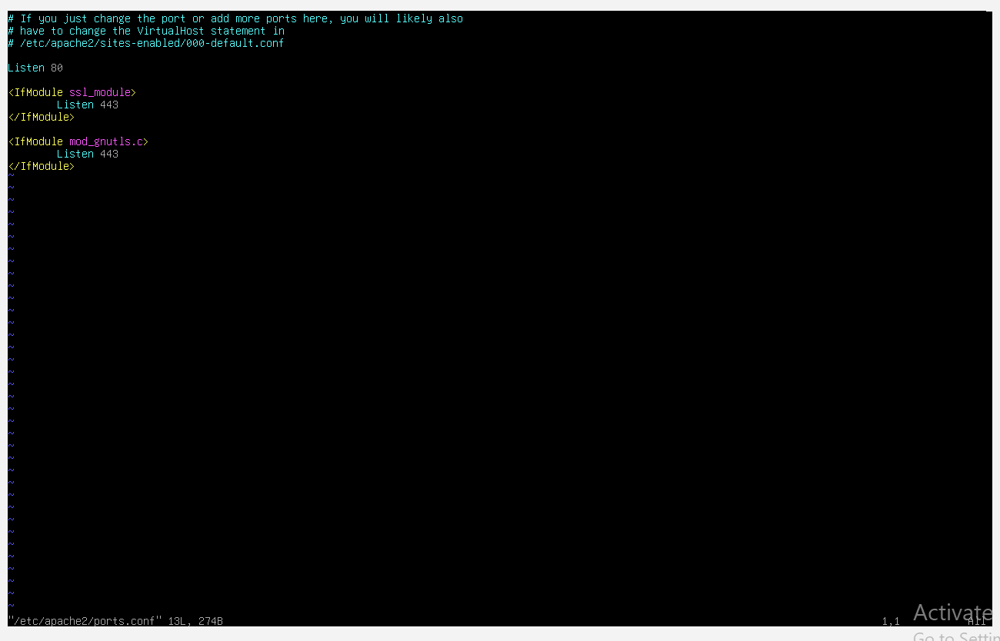
* The command is: `sudo` + `vim` + `/etc/apache2/apache2.conf`
* The file that controls global server behavior.
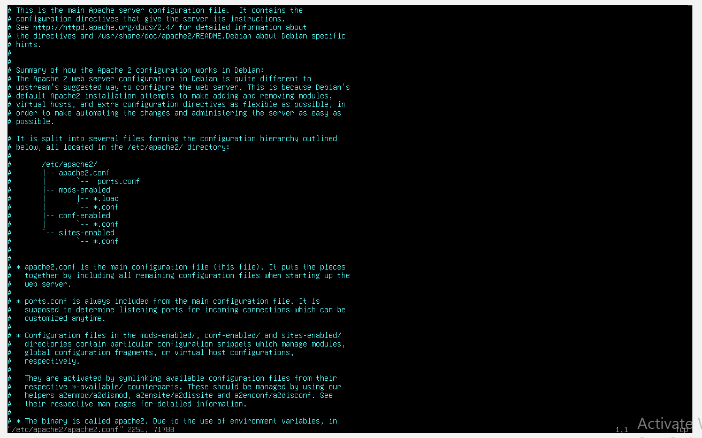

**7.  Where does Apache store logs?**
* The command is: `sudo` + `tail` + `-20` + `/var/log/apache2/access.log`
* To view recent log entries.
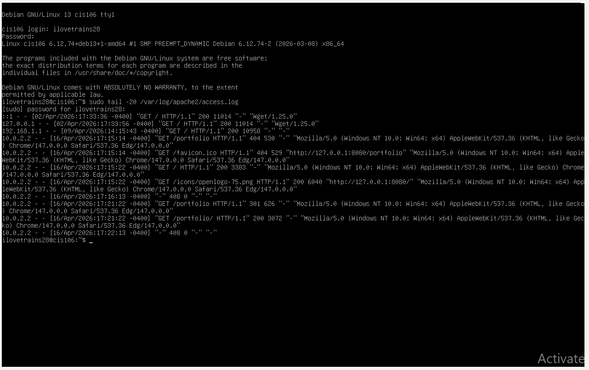

**8.  What are some basic commands we can use to review logs?**
* The command is: `sudo` + `journalctl` + `-f`
* Follows logs in real-time.
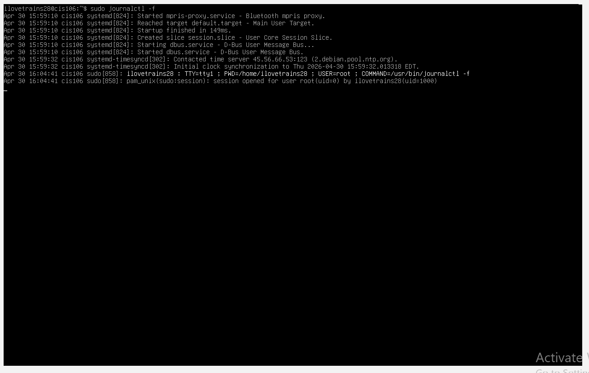
* The command is: `journalctl` + `-p` + `err`
* Filters for error-level messages.
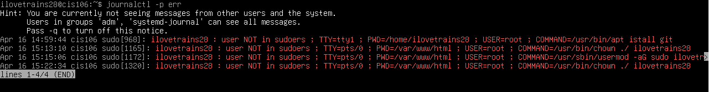
The command is: `journalctl` + `--since` + `"1 hour ago"`
* Shows logs from a specific timeframe.
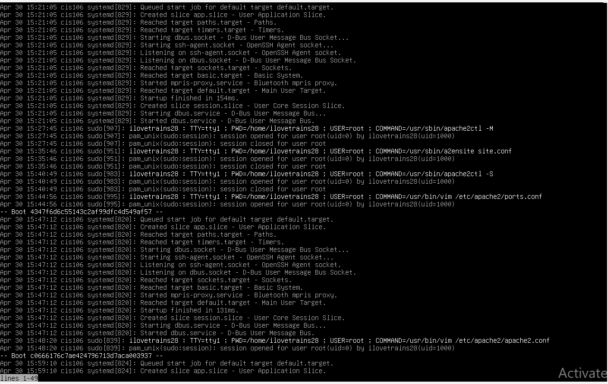