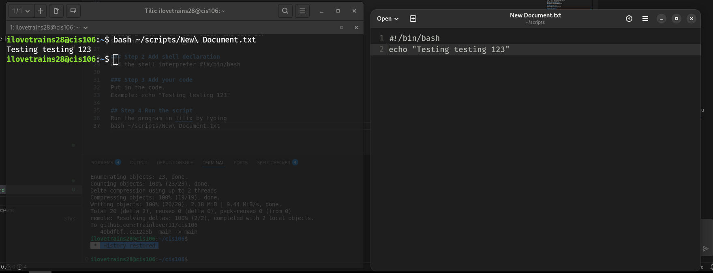

# Notes 4

## How to install and remove software using the APT command.

Step 1 is update debian.
`sudo apt update; sudo apt upgrade -y`

Step 2 to install
`sudo apt install package_name`

Step 3 uninstall
`sudo apt remove python3`

Example from slides:
* `sudo apt install firefox flameshot caffeine -y`
* Installs several programs in one command.
* `sudo apt remove firefox flameshot caffeine -y`
* Removes several programs in one command.
* `sudo apt purge firefox+ flameshot- caffeine- vlc+`
* Removes programs and all remaining traces.

## How to create a shell script.

### Step 1 Create the file
Create a file in the text editor and save it. 
Save the file as file_name.txt

### Step 2 Add shell declaration
Add the shell interpreter #!#/bin/bash

### Step 3 Add your code
Put in the code.
Example: echo "Testing testing 123"

### Step 4 Run the script
Run the program in tilix by typing 
bash ~/scripts/New\ Document.txt 
