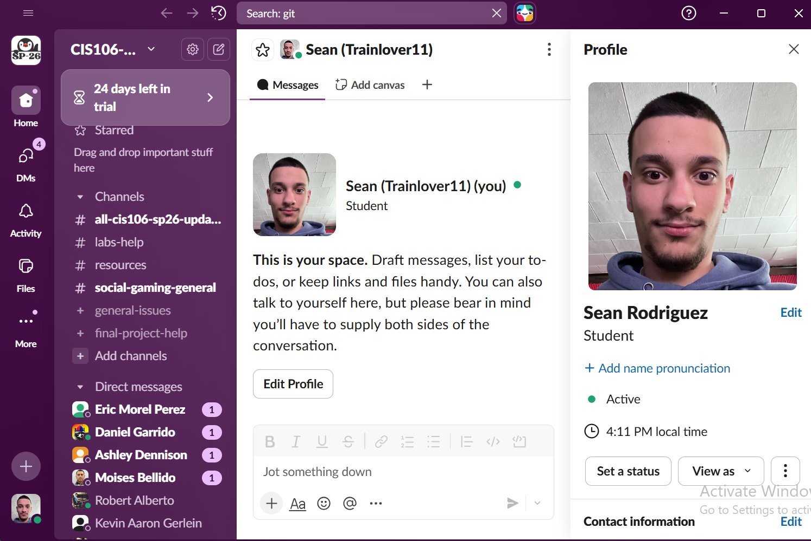
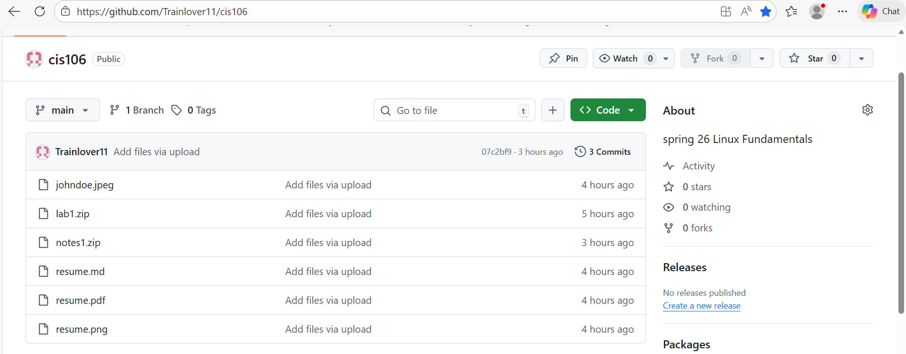

# Week Report 1 Submission

## Slack Screenshot

## Github Screenshot

## Acknowledgements
* By submitting this assignment I Sean Rodriguez acknowledge that I have read the syllabus or home page of the course
* I also acknowledge that I have written down any questions that I have for the professor and will ask them in class, via Slack 
* I also acknowledge that I am aware that the final exam is In Person
